# ☕ SMART CANTEEN

**Java OOP-Based Canteen Ordering & Management System** — a 2nd-year Java OOP college project.

> "Order smart. Skip the queue."

Students and faculty log in, pick food from the canteen menu, choose a pickup time, make a **demo** payment and track their order.
The canteen staff (admin) manage the menu and update order statuses. Everything is stored in a **MySQL** database and the
whole application is written with **Java Servlets + JSP + JDBC** (no Spring, no Hibernate).

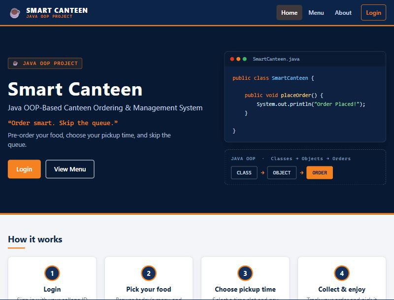

---

## Table of contents

1. [Features](#1-features)
2. [Technology stack](#2-technology-stack)
3. [Architecture](#3-architecture)
4. [Project structure](#4-project-structure)
5. [OOP concepts used (and where)](#5-oop-concepts-used-and-where)
6. [Database setup](#6-database-setup)
7. [How to configure MySQL](#7-how-to-configure-mysql-connection)
8. [How to run](#8-how-to-run)
9. [How to deploy](#9-how-to-deploy)
10. [Demo credentials](#10-demo-credentials)
11. [Business rules](#11-business-rules-worth-knowing-for-the-viva)
12. [Sample screens](#12-sample-screens)
13. [Testing checklist](#13-testing-checklist)
14. [Security notes](#14-security-notes)
15. [Future enhancements](#15-future-enhancements)

---

## 1. Features

**Students / faculty**
- Register and log in (session based), password stored as a salted hash
- Dashboard with available food, cart size, order count and the upcoming pickup
- Menu with **category filter** and **search** (name or category); sold-out food shows *Currently Unavailable*
- Cart kept on the server (in the `HttpSession`): add, change quantity (+ / − / type), remove
- Checkout: choose **pickup date + time slot**, choose UPI / Card / Cash at Counter
- **Demo payment** (no real money, no payment gateway) → payment confirmation with a transaction id
- Order list and **order tracking** page (Placed → Payment → Preparing → Ready → Completed)
- **Cancel an order within 5 minutes** (checked in Java on the server, not only in JavaScript)

**Admin / canteen staff**
- Separate admin login and admin panel (sidebar: Dashboard, Food Menu, Add Food, Orders, Logout)
- Dashboard: total food items, available items, pending orders, completed orders, latest orders
- Add, edit and delete food (delete asks for confirmation); switch a food Available / Unavailable
- See all orders and change their status (PLACED, PREPARING, READY, COMPLETED, CANCELLED) — saved in MySQL

Responsive design (desktop, laptop, tablet, mobile) with plain CSS media queries.

## 2. Technology stack

| Layer | Technology |
|---|---|
| Frontend | HTML5, CSS3, basic JavaScript (no framework, no Bootstrap) |
| Backend | Java 17+, Java OOP, **Servlets**, **JSP + JSTL** (only for pages), **JDBC** |
| Database | MySQL 8 |
| Server | Apache Tomcat **10.1** (or 11) — Jakarta Servlet 6 |
| Build | Maven (produces `smartcanteen.war`) |

Not used on purpose: Spring, Hibernate/JPA, Docker, WebSockets, real payment gateways, etc.

## 3. Architecture

```
  Browser (HTML / CSS / JavaScript)
        │  HTTP request
        ▼
  ┌──────────────┐   AuthFilter checks login + role first
  │   Servlet    │   (controller: reads the request, calls a service, picks the JSP)
  └──────┬───────┘
         ▼
  ┌──────────────┐
  │   Service    │   (business logic: validate cart, calculate total,
  └──────┬───────┘    cancellation rule, payment, update status)
         ▼
  ┌──────────────┐
  │     DAO      │   (only place with SQL: PreparedStatement)
  └──────┬───────┘
         ▼
  ┌──────────────┐
  │     JDBC     │   (DBConnection → mysql-connector-j)
  └──────┬───────┘
         ▼
      MySQL  ──►  result goes back up  ──►  Servlet forwards to a JSP  ──►  HTML to the Browser
```

The JSP pages live in `WEB-INF/views/`, so a browser can **never open a JSP directly** — every page is reached
through a servlet, which loads the data first (this is the MVC idea: *Model* = `model` classes,
*View* = JSP, *Controller* = servlets).

## 4. Project structure

```
CBP_Java/
├── pom.xml                     Maven build (packaging = war)
├── schema.sql                  creates the database and the 5 tables
├── seed.sql                    demo users + 12 food items
├── .env.example                the 3 database settings (placeholders only)
├── README.md
├── docs/screenshots/           screenshots used in this README
└── src/main/
    ├── java/com/smartcanteen/
    │   ├── model/              User (abstract), Student, Admin, FoodItem, Cart, CartItem,
    │   │                       Order, OrderItem, OrderStatus (enum), Payment, PickupSlot
    │   ├── dao/                UserDAO, FoodItemDAO, OrderDAO, PaymentDAO      (SQL + JDBC)
    │   ├── service/            UserService, FoodService, OrderService          (business logic)
    │   │                       PaymentService (interface), DemoPaymentService, CashPaymentService
    │   │                       ServiceException
    │   ├── servlet/            BaseServlet + Login, Register, Logout, About, Menu, Dashboard, Cart,
    │   │                       Checkout, OrderSuccess, Orders, OrderDetails, CancelOrder, Profile
    │   │   └── admin/          AdminDashboard, AdminMenu, AddFood, EditFood, AdminOrders
    │   ├── filter/             AuthFilter (login + role check)
    │   └── util/               DBConnection, PasswordUtil, AppStartupListener
    ├── resources/              db.properties.example
    └── webapp/
        ├── index.jsp           landing page (the only JSP outside WEB-INF)
        ├── css/                style.css, login.css, menu.css, admin.css
        ├── js/                 script.js
        ├── META-INF/context.xml    Tomcat: session cookie SameSite=Lax
        └── WEB-INF/
            ├── web.xml         welcome file, UTF-8, session settings, error pages
            └── views/          login, register, about, dashboard, menu, cart, checkout,
                │               order-success, orders, order-details, profile, error  (.jsp)
                ├── admin/      dashboard, menu, add-food, edit-food, orders  (.jsp)
                └── includes/   header, footer, messages, admin-header, admin-footer,
                                food-card.jspf, food-form.jsp
```

> **Note:** the pages are inside `WEB-INF/views/` instead of the webapp root. This is intentional: it makes it
> impossible to open `menu.jsp` or `admin/dashboard.jsp` by typing the file name, so the login/role checks cannot be bypassed.

### URLs

| URL | Who | What |
|---|---|---|
| `/` , `/about` , `/menu` , `/login` , `/register` | everyone | public pages (admins are sent from `/menu` to `/admin/menu`) |
| `/dashboard` `/cart` `/checkout` `/order-success` `/orders` `/order-details` `/cancel-order` `/profile` | students | protected by `AuthFilter` |
| `/admin/dashboard` `/admin/menu` `/admin/add-food` `/admin/edit-food` `/admin/orders` | admin | protected by `AuthFilter` |
| `/logout` | logged-in users | ends the session |

## 5. OOP concepts used (and where)

| Concept | Where to find it | Explanation |
|---|---|---|
| **Encapsulation** | every class in `model/` | private fields + getters/setters; e.g. `FoodItem`, `Order`, `Payment` |
| **Inheritance** | `User` → `Student`, `Admin` ; `BaseServlet` → all servlets | subclasses reuse the fields and helper methods of the parent |
| **Abstraction** | `abstract class User` | a `User` object is never created directly; it declares `getDashboardPath()` and `getRoleTitle()` without a body |
| **Interface** | `PaymentService` | says *what* a payment service does (`processPayment`, `getPaymentMethod`, …) but not *how* |
| **Polymorphism** | `LoginServlet`: `redirect(user.getDashboardPath())` ; `OrderService`: `paymentService.processPayment(...)` | the same call behaves differently for `Student`/`Admin` and for `DemoPaymentService`/`CashPaymentService` |
| **Method overriding** | `Student` and `Admin` override `getDashboardPath()` / `getRoleTitle()`; `@Override` on every interface method | each subclass gives its own version |
| **Constructors** | `Student(id, name, collegeId, password, email)`, `OrderItem(...)`, `Payment(...)`, `CartItem(...)` | initialise objects; subclasses call `super(...)` |
| **Collections** | `Cart` (`LinkedHashMap<Integer, CartItem>`), `OrderService` (`Map<String, PaymentService>`), `List<FoodItem>`, `List<Order>` | store and look up objects |
| **Enum** | `OrderStatus` | only 5 valid statuses; has its own methods (`isFinished()`, `fromText()`) |
| **Exception handling** | `ServiceException` (custom), `try / catch / finally`, try-with-resources in DAOs | SQL errors are logged in the console; the user sees only *"Something went wrong. Please try again."* |
| **JDBC** | `DBConnection`, all `*DAO` classes | `PreparedStatement`, `ResultSet`, transactions (`commit` / `rollback`) in `OrderService` |

**Transaction example** (`OrderService.placeOrder`): the order, its items and its payment are saved in *one* database
transaction — if anything fails, `rollback()` undoes everything, so there can never be an order without a payment.

## 6. Database setup

Five tables (see `schema.sql`):

```
users ──< orders ──< order_items >── food_items
              │
              └── payments   (one payment per order)
```

| Table | Main columns |
|---|---|
| `users` | id, name, college_id (unique), email, password (hash), role (`STUDENT` / `ADMIN`) |
| `food_items` | id, name (unique), description, category, price, image, available |
| `orders` | id (starts at 1001 → shown as **SC1001**), user_id, total_amount, order_date, pickup_time, status |
| `order_items` | id, order_id, food_id, quantity, price (the price at the time of ordering) |
| `payments` | id, order_id, amount, payment_method, payment_status, transaction_id, payment_date |

Foreign keys connect the tables. Food that appears in an old order cannot be deleted (mark it *Unavailable* instead).

## 7. How to configure MySQL connection

The database settings are **not written in the Java code**. `util/DBConnection.java` reads them from (first one found wins):

1. environment variables `DB_URL`, `DB_USERNAME`, `DB_PASSWORD`
2. Java system properties (`-DDB_URL=...`)
3. a `db.properties` file on the classpath (copy `src/main/resources/db.properties.example` to `db.properties`)

`.env.example` shows the three variables. Defaults if nothing is set: URL `jdbc:mysql://localhost:3306/smart_canteen?...`, user `root`, empty password.

### Step 1 – create the database and demo data

```bash
mysql -u root -p < schema.sql
mysql -u root -p smart_canteen < seed.sql
```

(To start again from zero: `DROP DATABASE smart_canteen;` and run both files again.)

### Step 2 – create a limited MySQL user for the application (recommended)

```sql
CREATE USER 'canteen_user'@'localhost' IDENTIFIED BY 'choose_your_own_password';
GRANT SELECT, INSERT, UPDATE, DELETE ON smart_canteen.* TO 'canteen_user'@'localhost';
```

### Step 3 – give the settings to Tomcat

Tomcat does **not** read `.env` files. The usual way on Windows is a file `<tomcat>\bin\setenv.bat`
(Tomcat runs it automatically; the quotes matter because of the `&`):

```bat
@echo off
set "DB_URL=jdbc:mysql://localhost:3306/smart_canteen?useSSL=false&allowPublicKeyRetrieval=true&characterEncoding=UTF-8"
set "DB_USERNAME=canteen_user"
set "DB_PASSWORD=choose_your_own_password"
```

Linux / macOS: create `<tomcat>/bin/setenv.sh` with `export DB_URL="..."`, `export DB_USERNAME=...`, `export DB_PASSWORD=...`.

When the application starts, the Tomcat console prints either
`Smart Canteen started. Database connection is OK.` or a clear error telling you what to check.

## 8. How to run

**Requirements:** JDK 17 or newer, Maven 3.8+, MySQL 8, Apache Tomcat **10.1.x or 11.x**
(the project uses the `jakarta.servlet` packages; it will **not** start on Tomcat 9 or older).

```bash
# 1. build the WAR
mvn clean package            # creates target/smartcanteen.war

# 2. copy it into Tomcat
copy target\smartcanteen.war  <tomcat>\webapps\          # Windows
cp   target/smartcanteen.war  <tomcat>/webapps/          # Linux / macOS

# 3. start Tomcat (JAVA_HOME must point to your JDK)
<tomcat>\bin\startup.bat                                  # Windows
<tomcat>/bin/startup.sh                                   # Linux / macOS
```

Open **http://localhost:8080/smartcanteen/** and log in with the demo credentials below.

Running from an IDE (IntelliJ IDEA Ultimate / Eclipse): create a *Tomcat 10.1 Server* run configuration, deploy the
`smart-canteen:war exploded` artifact, set the three `DB_*` variables in the run configuration, and open `/smartcanteen`.

## 9. How to deploy

The project is **deployment-ready**: `mvn clean package` produces a normal Java web archive that any Tomcat 10.1+
server can run.

1. Install Java, Tomcat 10.1+ and MySQL on the server.
2. Run `schema.sql` (and `seed.sql` for demo data) on the server's MySQL.
3. Create the MySQL user and put the `DB_*` settings in `setenv.bat` / `setenv.sh` (never inside the WAR or the source code).
4. Copy `smartcanteen.war` to `<tomcat>/webapps/` (to serve it at the root URL `/`, name the file `ROOT.war`).
5. Start Tomcat and check `logs/catalina.*.log` for *"Database connection is OK"*.

> **Honest status:** this project has been built and tested on a local Windows machine only. It has **not** been
> deployed to any public server, so there is no live public URL. For a real public deployment you would also
> add HTTPS and change the demo passwords.

## 10. Demo credentials

> ⚠️ **DEMO credentials for the college project only.** They are created by `seed.sql`. Change or delete them before using the system for anything real.

| Role | Login type on the login page | ID | Password |
|---|---|---|---|
| Student | Student / Faculty | `STU001` | `student123` |
| Student | Student / Faculty | `STU002` | `student123` |
| Admin | Admin | `ADMIN001` | `admin123` |

New students can also create an account on the **Register** page (admin accounts cannot be created there).
The passwords are never shown in the application; the database stores only salted PBKDF2 hashes.

To create a hash for another password (for `seed.sql`):
`java -cp target/classes com.smartcanteen.util.PasswordUtil mypassword`

## 11. Business rules (worth knowing for the viva)

- **The server calculates the total.** The browser only displays prices. At checkout `OrderService.validateCart()` reads every
  food again from the database (price and availability) and the total is computed in Java. Any total sent by the browser is ignored.
- **Cancellation:** an order can be cancelled only while it is `PLACED` **and** within **5 minutes** of `order_date`
  (`OrderService.CANCELLATION_MINUTES`). The button is hidden/disabled after that, *and* the server refuses a forged request.
- **Payments are simulated.** UPI and Card use `DemoPaymentService` (always succeeds, transaction id like `DEMO123456`).
  *Cash at Counter* uses `CashPaymentService` (payment stays `PENDING` until the order is `COMPLETED`).
  Cancelling an order marks a paid demo payment as `REFUNDED`.
- **Pickup slots:** 10:30 AM – 2:00 PM every 30 minutes, for today or tomorrow, at least 10 minutes from now.
- **Order status** always comes from the database. Completed and cancelled orders are final and cannot be changed again.
- **Unavailable food** cannot be added to the cart, and is checked again at checkout.
- **Cart** lives in the server session; it is empty after logout or after the session times out (30 minutes).

## 12. Sample screens

| | |
|---|---|
| **Login** 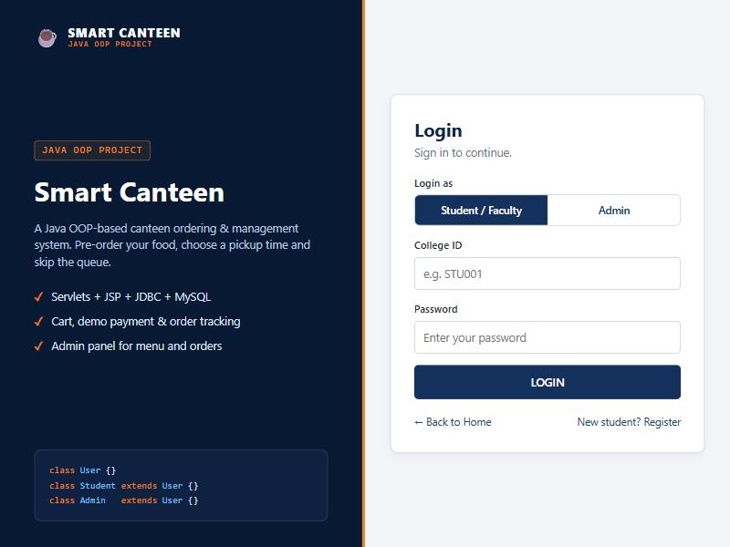 | **Student dashboard** 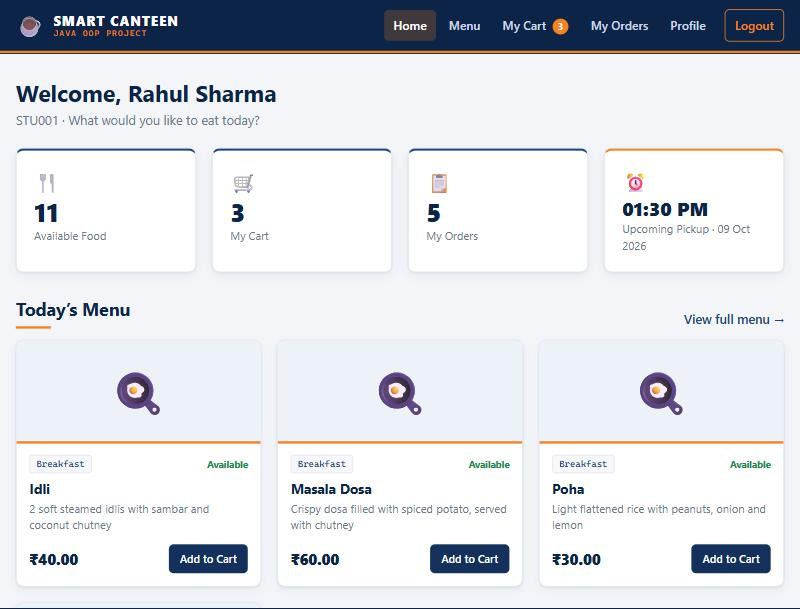 |
| **Menu** (filter *Meals*, one item sold out) 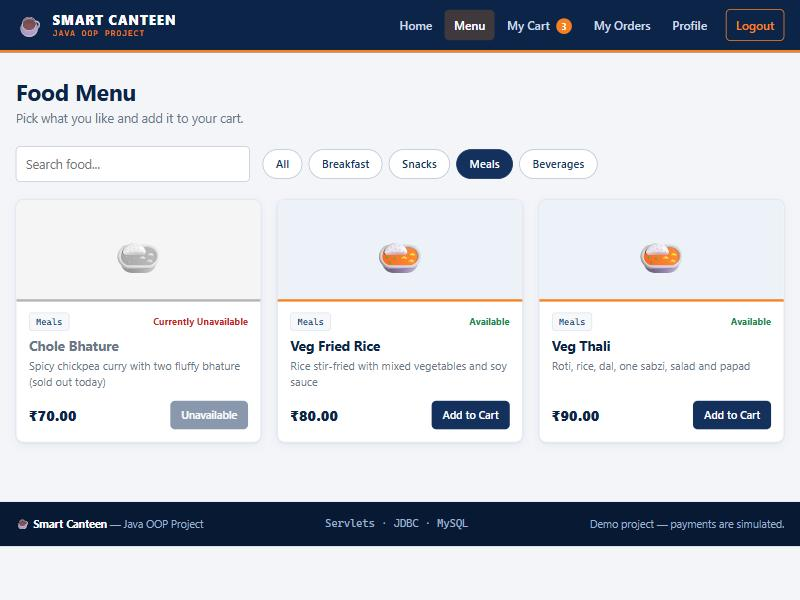 | **Cart** 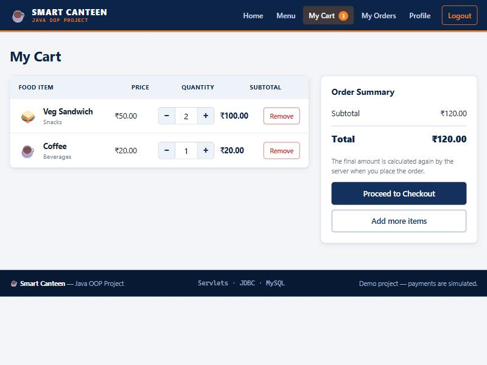 |
| **Checkout** 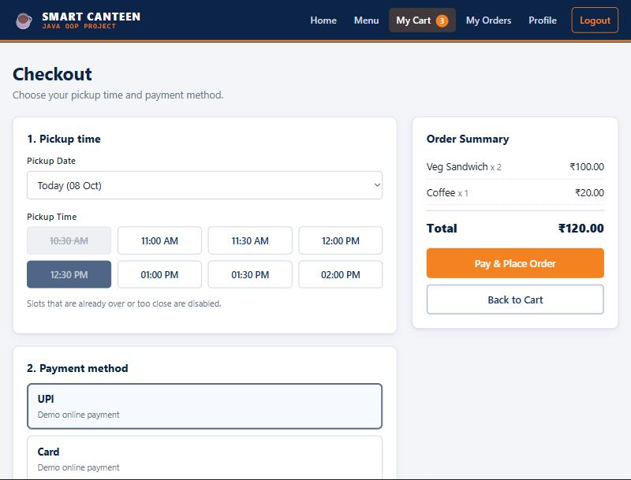 | **Demo payment confirmation** 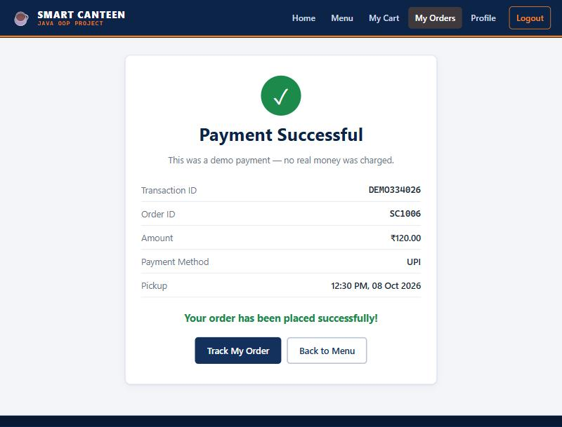 |
| **Order tracking** 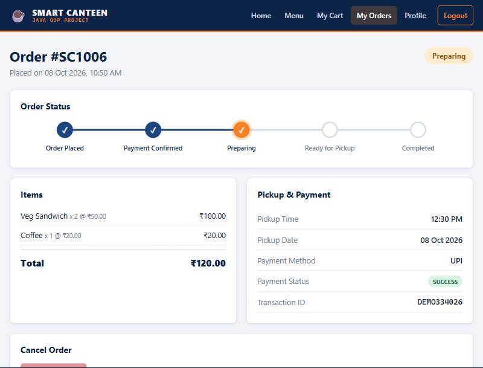 | **Admin dashboard** 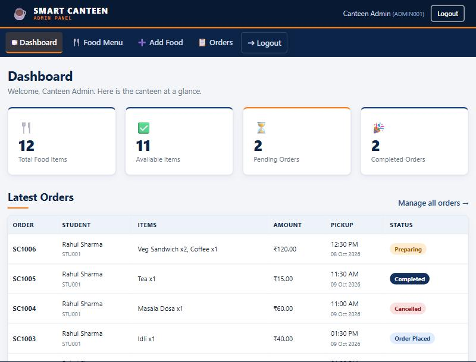 |
| **Admin – orders** 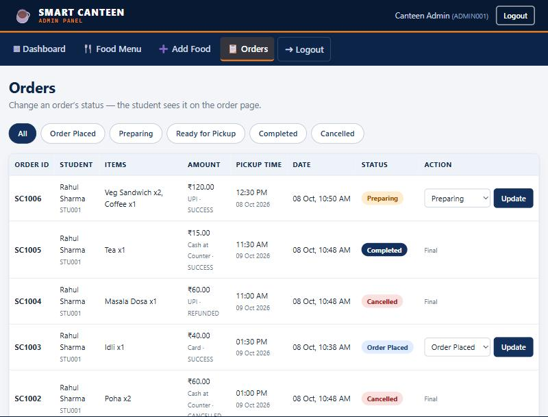 | **Admin – food menu** 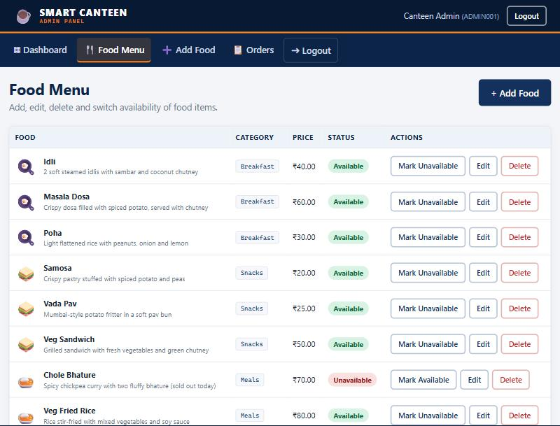 |

## 13. Testing checklist

This checklist was run on the finished project (Windows 11, JDK 21 compiling for Java 17, MySQL 8.4, Tomcat 10.1) with real
HTTP sessions and a real MySQL database, plus manual checks in a browser (including a phone-size window). You can repeat it by hand:

1. Start MySQL and Tomcat, open `http://localhost:8080/smartcanteen/`
2. Log in as `STU001` (a wrong password shows *Invalid college ID or password.*)
3. Open **Menu**, try the category buttons and the search box
4. Add Veg Sandwich and Coffee to the cart, press **+**, type `99` as a quantity (rejected), remove one item
5. **Proceed to Checkout** → choose a pickup slot and UPI → **Pay & Place Order**
6. Check the confirmation (transaction id, order id `SC1001`) and the **My Orders** list
7. Log out, log in as `ADMIN001` (Admin tab) → **Orders** → set the order to *Preparing*, then *Ready for Pickup*
8. Log in as the student again → open the order: the tracker shows the new status
9. Place a second order and press **Cancel Order** within 5 minutes (works); try cancelling an order that is already *Preparing* (refused)
10. As admin: **Add Food**, **Edit** it, mark it **Unavailable**, then try to add it to a cart as a student (refused: *This item is currently unavailable.*)
11. Try to delete a food that was ordered (refused, with an explanation) and one that was never ordered (works, after a confirmation)
12. Try to open `/admin/orders` as a student and `/cart` as an admin (both are redirected)
13. Stop MySQL and open the menu: the page shows *Something went wrong. Please try again.* (details only in the Tomcat console)

## 14. Security notes

Appropriate for a student project, kept simple on purpose:

- Session login, role check in `AuthFilter`, new session id after login (against session fixation), `HttpOnly` + `SameSite=Lax` session cookie
- Every SQL query uses `PreparedStatement` (no string concatenation of user input)
- Passwords hashed with salted PBKDF2 (built into Java); the hash is removed from the object stored in the session and is never shown
- Database settings come from environment variables / config, not from the source code
- All user text is printed with `<c:out>` (HTML-escaped) to prevent XSS
- Users never see Java stack traces (custom error page + friendly messages)

Not included (see future enhancements): CSRF tokens, login attempt limits, HTTPS configuration.

## 15. Future enhancements

- Real online payment gateway (e.g. Razorpay) in place of `DemoPaymentService` — only a new class implementing `PaymentService` is needed
- Email / SMS notification when the order is *Ready for Pickup*
- Auto-refreshing order status page
- Edit profile / change password / forgot password
- CSRF tokens, login attempt limiting, HTTPS
- Food image upload, daily special items, stock quantity per item
- Sales reports for the admin (daily / monthly)
- Pagination for orders, connection pooling (e.g. Tomcat JNDI `DataSource`)
- Unit tests for the service classes (JUnit)
